# ML Model Specification

## Overview

The ML component predicts the **failure reason** of a payment transaction given its features.
This is a **multi-class classification** problem with 5 target classes.

## Target Classes

| Class | Description | Weight |
|-------|-------------|--------|
| `insufficient_funds` | Customer has insufficient account balance | ~40% |
| `network_error` | Gateway timeout, DNS failure, connection reset | ~25% |
| `fraud_suspected` | Transaction blocked by anti-fraud rules | ~15% |
| `expired_card` | Payment instrument has expired | ~12% |
| `invalid_credentials` | Wrong card number, CVV, or account details | ~8% |

## Input Features

| Feature | Type | Range / Values | Engineering |
|---------|------|---------------|-------------|
| `amount` | Numeric | 0.01 - 1,000,000 | StandardScaler |
| `device` | Categorical | mobile, desktop, tablet | OneHotEncoder |
| `country` | Categorical | TR, US, DE, UK, BR, IN | OneHotEncoder |
| `payment_method` | Categorical | credit_card, debit_card, bank_transfer, digital_wallet | OneHotEncoder |
| `hour_of_day` | Numeric | 0 - 23 | StandardScaler |
| `day_of_week` | Numeric | 0 - 6 (Mon=0) | StandardScaler |

## Model Architecture

```python
Pipeline([
    ('preprocessor', ColumnTransformer([
        ('num', StandardScaler(), ['amount', 'hour_of_day', 'day_of_week']),
        ('cat', OneHotEncoder(handle_unknown='ignore'), 
         ['device', 'country', 'payment_method'])
    ])),
    ('classifier', RandomForestClassifier(
        n_estimators=200,
        max_depth=15,
        min_samples_split=10,
        min_samples_leaf=5,
        class_weight='balanced',
        random_state=42,
        n_jobs=-1
    ))
])
```

## Training Pipeline

```mermaid
graph LR
    A[PostgreSQL] -->|Load Data| B[pandas DataFrame]
    B -->|Feature Engineering| C[Extract hour, day_of_week]
    C -->|Filter| D[Failed transactions only]
    D -->|Split 80/20| E[Stratified Train/Test]
    E -->|Train| F[Pipeline.fit]
    F -->|Evaluate| G[Classification Report]
    G -->|Save| H[model.joblib]
```



### Steps

1. **Data Loading**: Query all transactions with `status='failed'` from PostgreSQL
2. **Feature Engineering**:
   - Extract `hour_of_day` from `created_at` timestamp
   - Extract `day_of_week` from `created_at` timestamp
   - Select feature columns: `amount`, `device`, `country`, `payment_method`, `hour_of_day`, `day_of_week`
3. **Target**: `failure_reason` column
4. **Split**: 80% train / 20% test, stratified by target
5. **Train**: Fit the pipeline on training data
6. **Evaluate**: Generate classification report + confusion matrix on test data
7. **Save**: Serialize model with `joblib` to `models/model_YYYYMMDD_HHMMSS.joblib`
8. **Symlink**: Update `models/latest_model.joblib` to point to new model

## Evaluation Metrics

### Primary Metrics
- **Weighted F1-Score** (primary metric for model selection)
- **Per-class Precision/Recall** (for monitoring class-specific performance)
- **Confusion Matrix** (for error analysis)

### Minimum Thresholds (for production deployment)
| Metric | Minimum |
|--------|---------|
| Weighted F1 | > 0.70 |
| Per-class Recall | > 0.50 for each class |
| Per-class Precision | > 0.50 for each class |

### Class Imbalance Handling
- `class_weight='balanced'` in RandomForestClassifier
- Stratified train/test split
- Monitor per-class metrics (not just accuracy)

## Model Versioning

```
ml-service/models/
├── model_20260403_120000.joblib    # Timestamped version
├── model_20260402_090000.joblib    # Previous version
└── latest_model.joblib             # Symlink → latest
```

- Each training run creates a new timestamped model file
- `latest_model.joblib` always points to the most recent model
- Old models retained for rollback capability
- Model metrics logged to `ml-service/logs/training_history.json`

## Feature Importance (Expected)

Based on the data distribution, expected feature importance ranking:
1. `amount` — Higher amounts correlate with specific failure types
2. `device` — Mobile has different failure patterns
3. `country` — Regional banking differences
4. `payment_method` — Different processing pipelines
5. `hour_of_day` — Network issues peak at specific times
6. `day_of_week` — Weekend vs weekday patterns

## Retraining Strategy

- **Trigger**: Manual via `/model/retrain` endpoint or `/train-model` workflow
- **Frequency**: After significant new data (>5000 new transactions)
- **Validation**: New model must meet minimum thresholds before replacing current model
- **Rollback**: Previous model can be loaded by updating symlink

## Limitations & Future Improvements

### Current Limitations
- Rule-based data generation (synthetic, not real-world distribution)
- Limited feature set (6 features)
- No online learning (batch retraining only)
- Single model (no ensemble of different model types)

### Future Improvements
- [ ] Add historical user features (past failure rate per user)
- [ ] Add sequential features (time since last transaction)
- [ ] Implement SHAP for per-prediction explainability
- [ ] A/B testing framework for model comparison
- [ ] Gradient boosting comparison (XGBoost/LightGBM)
- [ ] Online learning for real-time model updates
